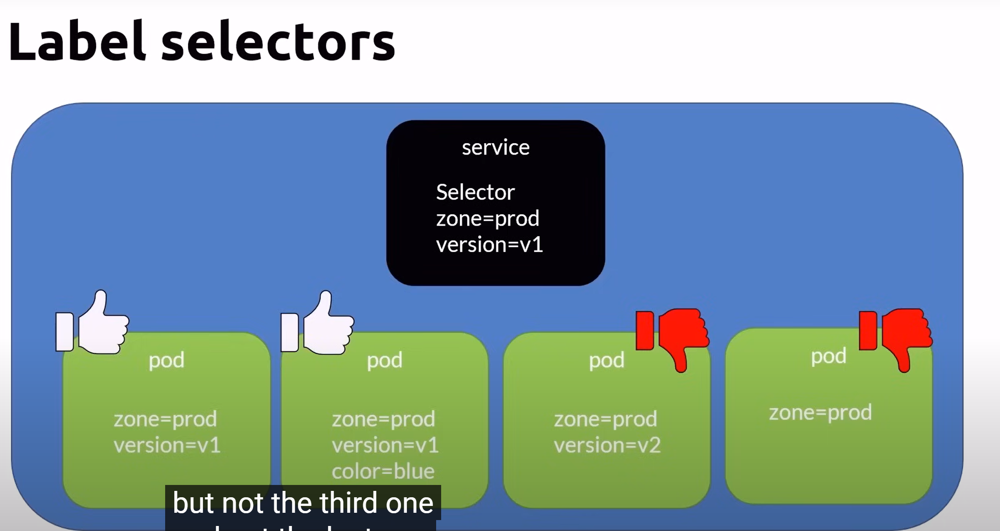
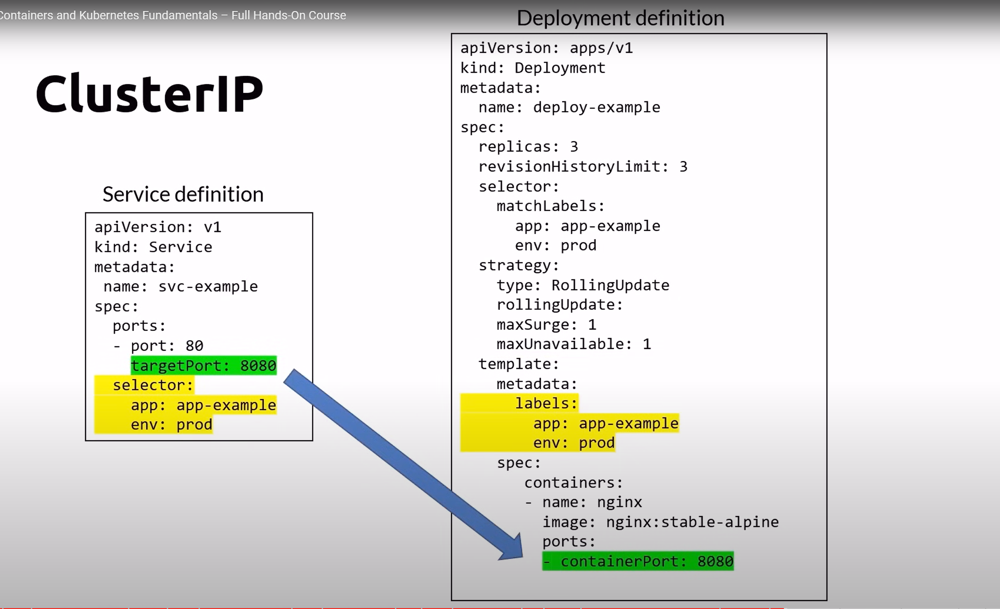
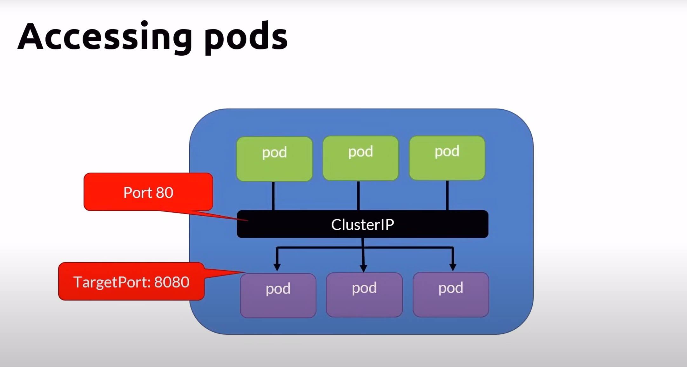
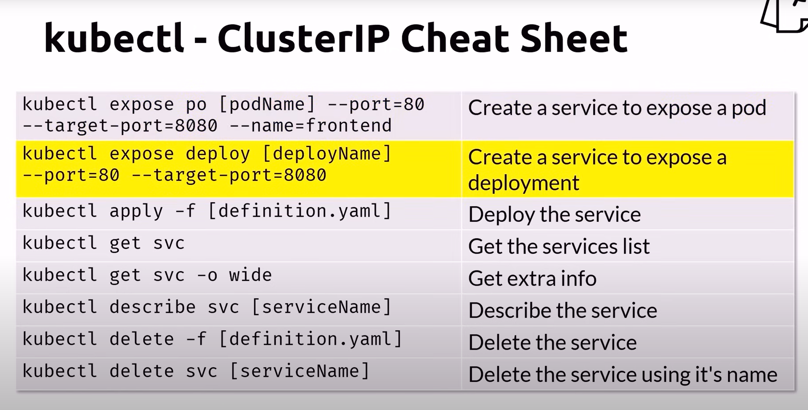
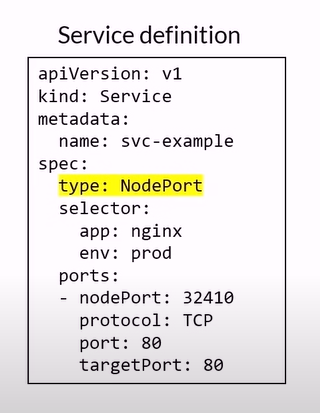
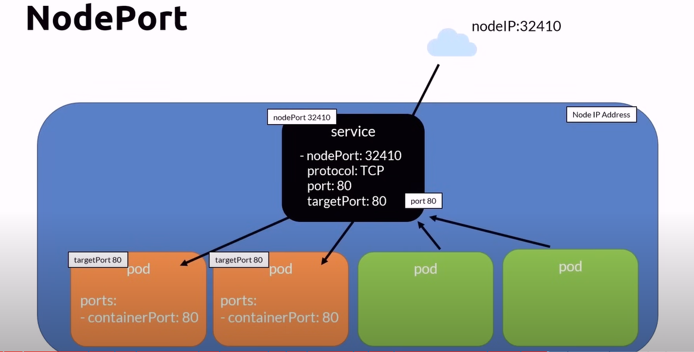
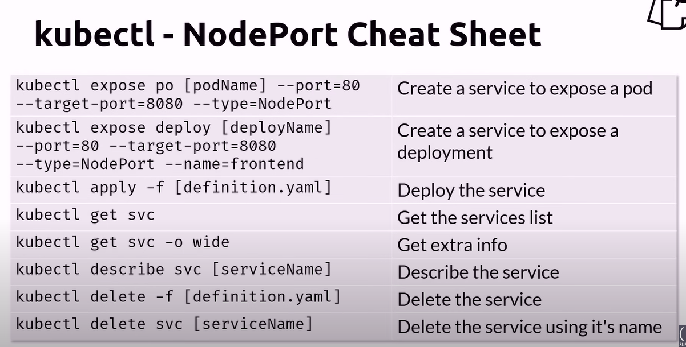

# Services

- what problem is services trying to solve?
- a service is another type of k8s object
- pod ips are unreliable but service IPs are
- Durable (unlike pods)
    - static ip address
    - static DNS name
    - [servicename].[namespace].svc.cluster.local
- Services are ways to access pods
- Target pods using selectors

## label selectors

## type
- clusterIP (default)
- NodePort
- LoadBalancer

## Cluster IP (default)
- ClusterIP is the default service
- visibility
    - cluster internal
- port 
    - the port the service is listening to
- targetPort
    - redirecting to the port the pods are listening to
- load balanced using round robin
    - session affinity is configurable
- when to use
    - to provide a durable way to communicate with pods inside the cluster

- deployment definition

- accessing

- clusterIp cheat sheet

## NodePort
- Nodeport extends the ClusterIp service
- visibility
    - internal and external
- NodePort
    - The port the service is listening to externally
    - statically defined or dynamically taken from a range between 30000 - 32767
- Port
    - The port the service is listening to internally
- TargetPort
    - Redirecting to the port the pods are listening to

- nodeport definition

- nodePort
    - statically defined, or dynamically taken from a range between 30000 - 32767
- use any node ip + nodeport to access the service
- nodeport accessing

- nodeport cheatsheet
