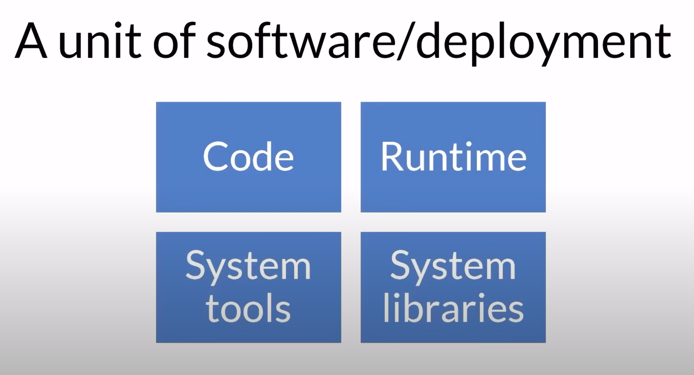
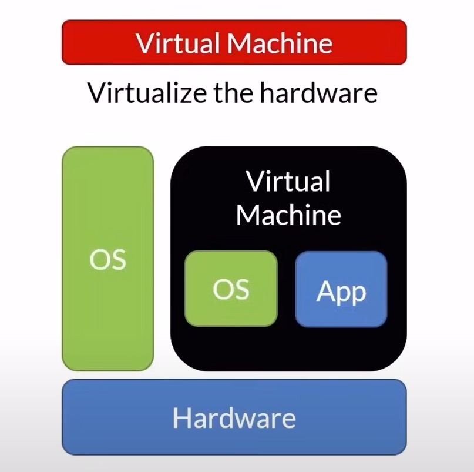
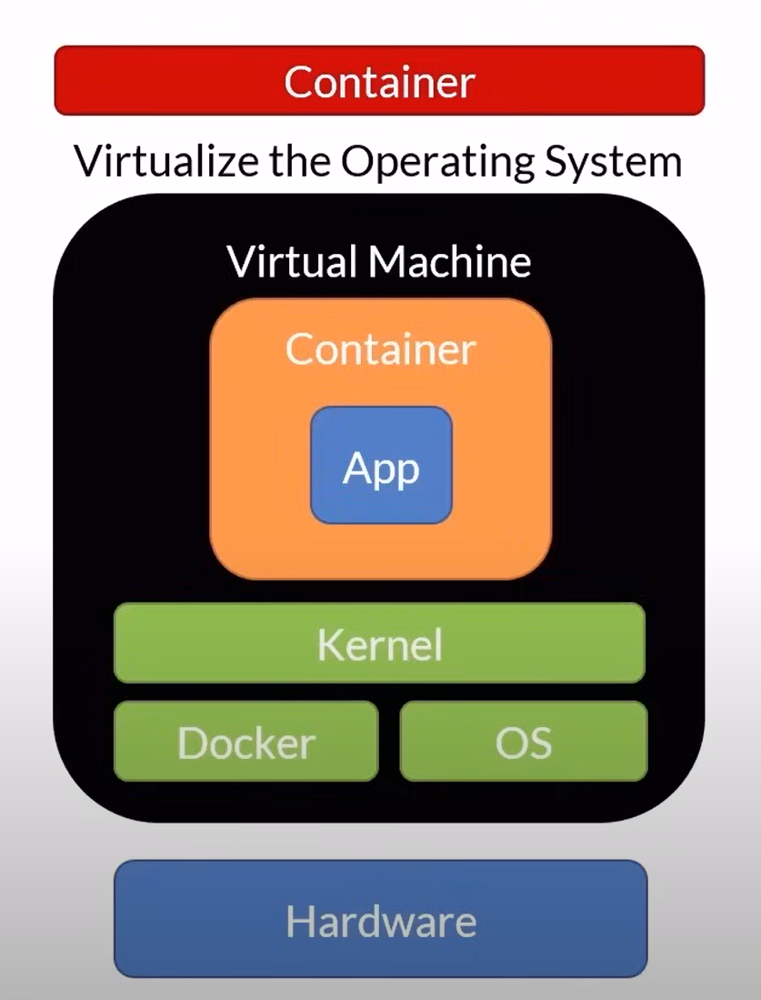
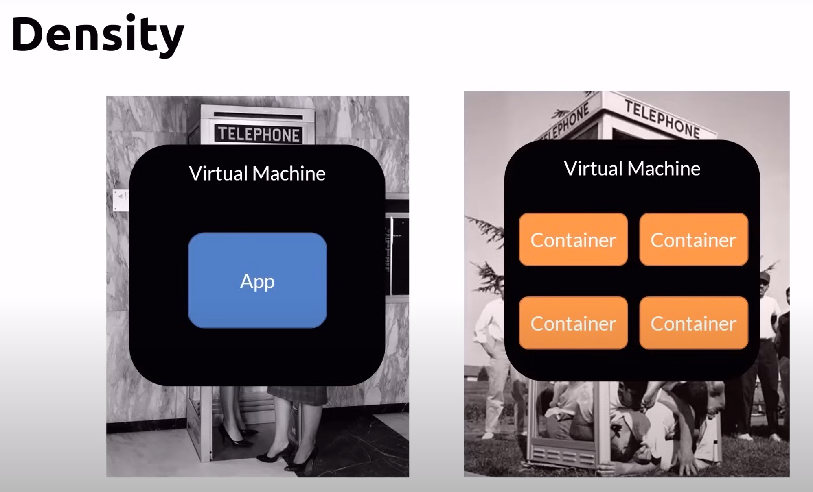

# What is a container?
A unit of software/deployment

It contains:

## Why containers?
- Move faster by deploying smaller units
- Use fewer resources
- Fit more into same host
- Faster automation
- Portability
- Isolation

## What is virtualized?
- An vm runs on some kind of hardware where OS is installed, the OS will let you create a virtual machine where you will install your OS

- Unlike virtual machine which it will start to boot an OS first, container does not need to boot resulting it to start in seconds. It also uses a lot less memory at the harddrive space as there is no OS

## VM vs Containers
| Virtual Machine | Container |
|----------|----------|
| Large footprint | Lightweight |
| Slow to boot | Quick to start (it does not have to boot) |
| Ideal for long running tasks | Portable |
|  | Ideal for short lived tasks |

Container is just another tool, not replacing virtual machines

## Density
- it is possible that you can have many containers in one virtual machine

## Containers are made of layers
We will start with a Base OS (Windows or Linux), customizations and your application

## Container registry
- Centralized container repository
- Think GitHub for containers
- Docker Hub
    - https://hub.docker.com/
- Most Cloud Providers have container registries service
    - AWS, Azure, Google Cloud

## Orchestrator
- Manage
    - Infrastructure
    - Containers
    - Deployment
    - Scaling
    - Scaaling
    - Failover
    - Health monitoring
    - App upgrades, Zero-Downtime deployments
- Install your own
    - Kubernetes, Swarm, Service Fabric
- Orchestractors as a service
    - Azure Kubernetes Service, Service Fabric

# What is Docker?
Docker is the company, the platform, it maintains he moby project(container runtime) that follows the spec from open container initiative

- It is an open source container runtime
- supports Mac, Windows & Linux
- a command line tool to create and manage a container
- "Dockerfile" file format for building container images
- Interestingly, Windows let you run Windows and Linux containers