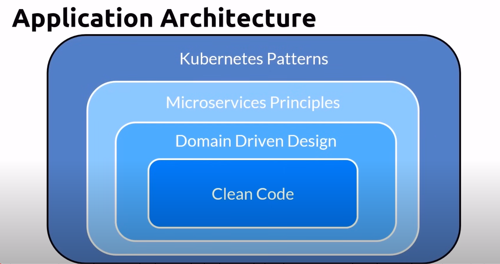
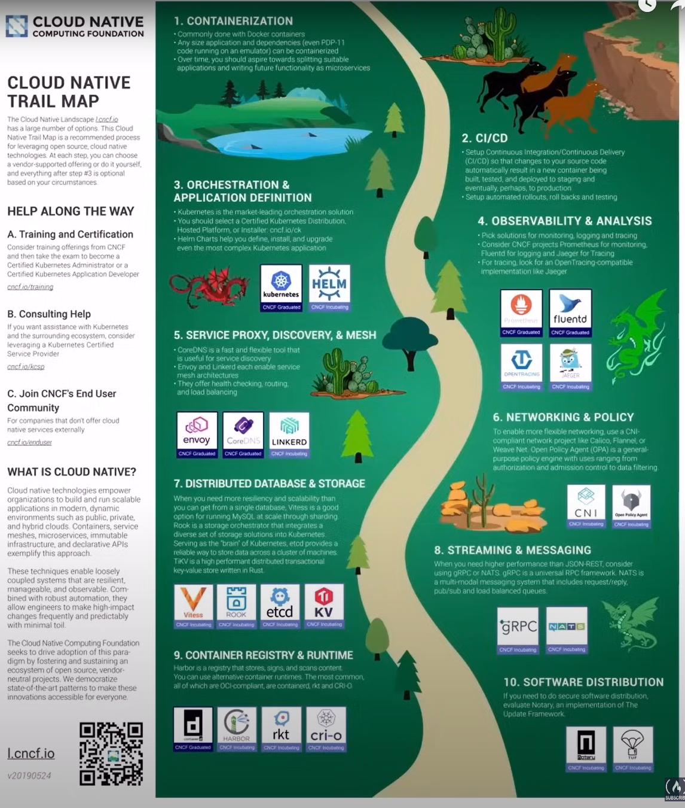

# Microservices Concepts

## Microservices Architecture
A variant of the service-oriented architecture (SOA) structural style - arranges an application as a collection of loosely coupled services.

In a microservices architecture, services are fine-grained and the protocols are lightweight

## Monolithic Architecture
- Built as single unit
- Deployed as a single unit
- Duplicated on each server
- Ex: 3-tier apps

## Microservices
- Segregates functionality into smaller seperate services each with a single responsibiliyy
- Scales out by deploying each service independently
- Loosely coupled
- Enable autonomous development by different teams, languages and platforms
- Can be written by smaller teams
- each microservices have have its own data/databases

## Unit of scaling - Traditional approach
Whole app is deployed in multiple servers

## Unit of scaling - Microsservice
Each service scale independently

## From Monlith to Microservices
- Break your application/system in small units
- Use the strangler patterm

## Microservices - Benefits
- Improved fault isolation
- Eliminate vendor or technology lock-in
- Ease of understanding
- Smaller and faster deployments
- Scalability

## Microservices - Drawbacks
- Complexity is added to resolve complexity issues
- Testing may appear simpler but is it?
- Deployment may appear simpler but is it?
    - Hard to do with multiple teams
    - One microsevice update can impact many microservices
- Multiple databases?
- Latency issues
- Transient errors
- Multiple point of failures
- How about Security?

# Cloud Native

## Speed and Agility
- Among many things, cloud native is about speed and agility
- Users want
    - Instantaneous responsiveness
    - up-to-the-minute features
    - No downtime
- The business wants
    - Accelerated innovation
    - Rapid releases of features to meet disruption from competitors
    - Increased confidence - stability/performance

## Application Architecture
- Kubernetes Patterns -> Microservices Principles -> Domain Driven Design -> Clean Code

## Mentality: Pets vs Cattle
- Infrastructure becomes immutable and disposable
- Provisioned in minutes and destroyed on demand
- Never updated or repaired but re-provisioned

## Cloud Native Trail Map
- Breaks the journey into measuravle objectives
    - e.g. Achieve step 1 by December
- Set key performance indicators
    - Measurable values

### First step - Containerization
- Commonly done with Docker containers
- Any size application and dependencies (even PDP-11 code running on an emulator) can be containerized
- Over time, you should aspire towards spliiting suitable applications and writing future functionality as microservices

### Second step - CI/CD
- Setup Continuous Integration/Continuous Delivery(CI/CD) so that changes to your source code automatically result in a new container being built, tested and deployed to staging and eventually, perhaps, to production
- Setup automated rollouts, roll backs and testing
- Agro is a set of Kubernetes-native tools for deploy and running jobs, applications, workflows, and events using GitOps paradigms such as continuous and progressive delivery and MLops

### Third step - Orchestration & Application Definition
- Kubernetes is the market-leading orchestration solution
- You should select a certified Kubernetes Distribution, Hosted Platform, or Installer: cncf.io/ck
- Helm Charts help you define, install, and upgrade even the most complex Kubernetes application

### Forth step - Observability & Analysis
- Pick solutions for monitoring, logging and tracing
- Consider CNCF projects Prometheus for monitoring, Fluentd for logging and Jaeger for Tracing
- For tracing, look for an OpenTracing-compatible implementation like Jaeger

### Fifth step - Service Proxy, Discovery & Mesh
- CoreDNS is a fast and flexible tool that is useful for service discovery
- Envoy and Linkerd each enable service mesh architectures
- They offer health checking, routing, and load balancing

### Sixth Step - Networking, Policy, Security
- To enable more flexible networking, use a CNI-compliant network project like Calico, Flannel, or Weave Net. Open Policy Agent (OPA) is a general-purpose policy engine with uses ranging from authorization and admission control to data filtering. Falco is an anomaly detection engine for cloud native

### We actually have more steps to go, we can explore on that as well
