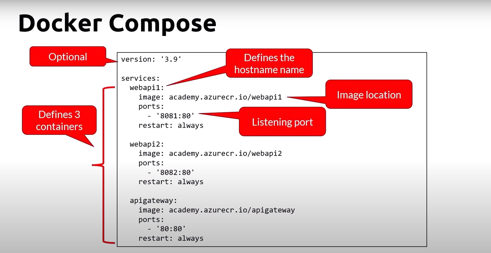

# YAML
- YAML: YAML is not a markup language
- Human friendly data serialization standard
- Used by Docker-Compose and Kubernetes

# Docker Compose Concepts

## Multi containers apps
- Docker Compose can help you to run multiple containers at once using single command

## Docker Compose
- Define and run multi-containers applications
- Define using YAML files
- Run using the docker CLI with the compose plugin
    - Docker compose
- Compose Specs

## Docker Compose - Use Cases
- Workloads that don't require a full orchestrator
- Development and tests
- Use of a service that can run Docker Compose files
    - Azure App Service
    - AWS ECS
    - Virtual machines

# Docker Compose Commands

| Command      | Description  |
|-----------|-------------|
| docker compose build     | Build the images |
| docker compose start       | start the containers |
| docker compose stop   | stop the containers |
| docker compose up -d   | build and start |
| docker compose ps   | list whats running |
| docker compose rm   | remove from memory |
| docker compose down   | stop and remove |
| docker compose logs   | get the logs |
| docker compose exec [container] bash   | run a command in a container |

## Compose V2 - New Commands

| Command      | Description  |
|-----------|-------------|
| docker compose --project-name test1 up -d     | Run an instance as a project |
| docker compose -p test2 up -d       | shortcut |
| docker compose ls   | list running projects |
| docker compose cp [containerId]:[SRC_PATH] [DEST_PATH]  | copy files from the container |
| docker compose cp [SRC_PATH]:[containerId] [DEST_PATH]   | copy files to the container |
| docker compose rm   | remove from memory |
| docker compose down   | stop and remove |
| docker compose logs   | get the logs |
| docker compose exec [container] bash   | run a command in a container |

