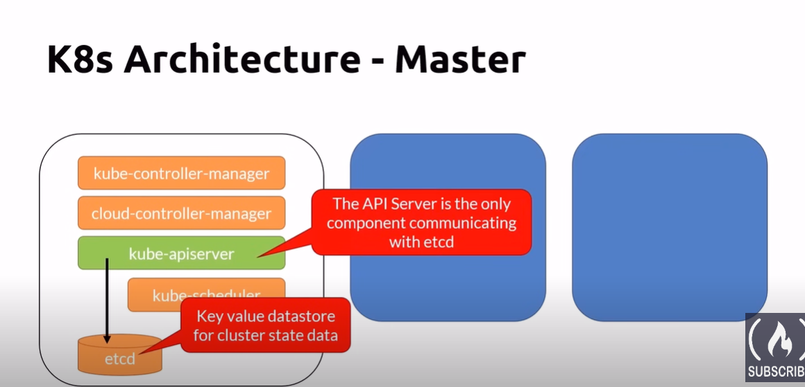
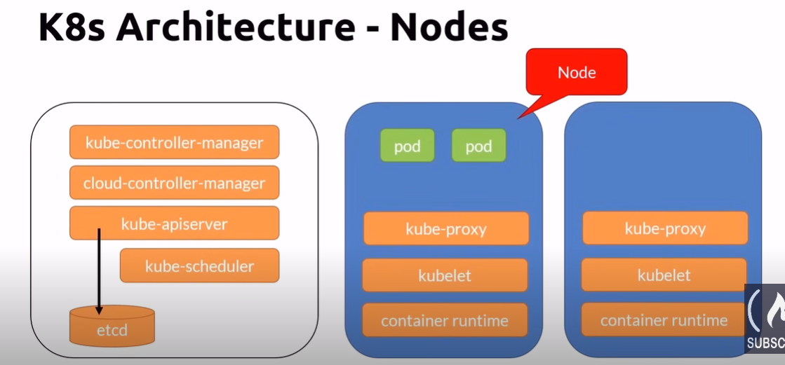

# K8s Architecture - Nodes

- Nodes are physical or virtual machines
- Master Node is also been called the control plane
- Normally we do not run containers in the master node

## K8s Architecture - Master
- etcd is a key value datastore for cluster state data
- the api server is the only component communicating with etcd

### kube-apiserver
- REST interface
- save state to the datastore (etcd)
- all clients interact with it, never directly to the datastore

### etcd
- Act as the cluster datastore for storing state
- key-value store
- not a database or a datastore for application to use
- The single source of truth

### kube-control-manager
- The controller of controllers!
- it runs controllers
    - node controller
    - replication controller
    - Endpoints controller
    - Service account & Token controllers

### cloud-control-manager
- Interact with the cloud providers controller
    - Node
        - For checking the cloud provider to determine if the node has been deleted in the cloud after it stops responding
    - Route
        - For setting up routes in the underlying cloud infrastructure
    - Service
        - For creating, updating and deleting cloud provider load balancers
    - Volume
        - For creating, attaching, and mounting volumes, and interacting with the cloud provider to orchestrate volumes

### kube-scheduler
- Watches newly created pods that have no node assigned, and selects a node for them to run on
- Factors taken into acount for scheduling decisions include
    - individual and collective resource requirements
    - hardware/software/policy constraints
    - affinity and anti-affinity specifications
    - data locality

### Addons
-DNS
-Web UI (dashboard)
- Cluster-level logging
- Container resource monitoring

## K8s Architecture - Nodes (Worker)

### kubelete
- Manage the pods lifecycle
- Ensure that the containers described in the Pod spec are running and healthy

### kube-proxy
- A network proxy
- Manages network rules on nodes

### Container runtime
- K8s supports several container runtimes
- Must implement the Kubernetes Container Runtime Interface
    - Moby
    - Containerd
    - Cri-0
    - Rkt
    - Kata
    - Virtlet

### Nodes Pool
- A node pool is a group virtual machines, all with the same size
- A cluster can have multiple node pools
    - These pools can host different sizes of VMs
    - Each pool can be autoscaled independently from the other pools
- Docker Desktop is limited to 1 node
