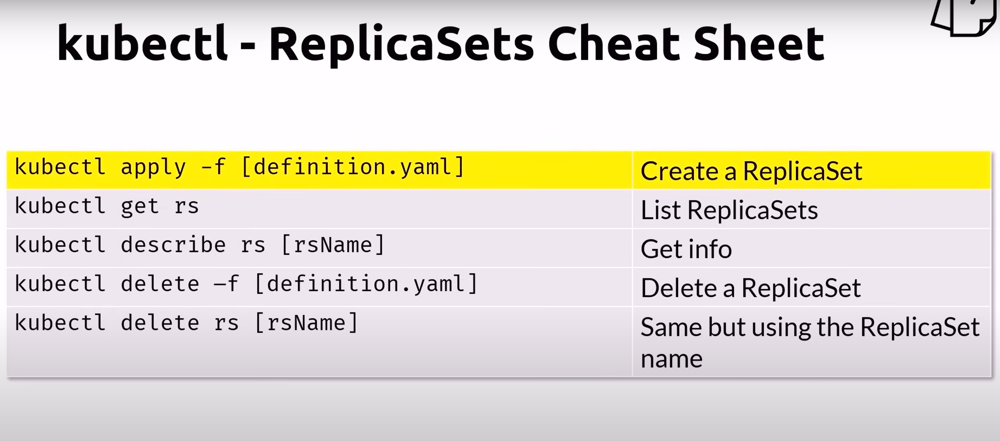

# Workloads
- A workload is an application running on Kubernetes
    - Pod
        - Represents a set of running containers
    - ReplicaSet
    - Deployment
    - StatefulSet
    - DaemonSet
        - Provide node-local facilities, such as storage driver or network plugin
    - Tasks that run to completion
        - Job
        - Cronjob

## ReplicaSets
- Primary method of managing pod replicas and their lifecycle to provide self-healing capabilities
- Their job is to always ensure the desired number of pods are running
- While you can create ReplicaSets, the recommended way is to create Deployments

### Self-Healing
- when u define replicaSets, it is self-healing, always ensure the number of is running

### kubectl replicaSet cheat sheet
