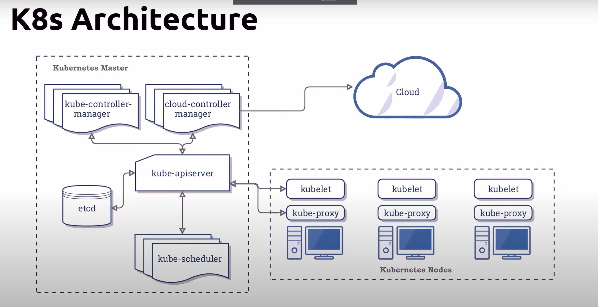

# Kubernetes a.k.a K8s
- Originated from Google
- Donated to the Cloud Native Computing
- leading container orchestration tool
- Designed as a loosely coupled collection of components centered around deploying, maintaining and scaling workloads
- vendor-neutral
    - runs on all cloud providers
- backed by large community

## What K8s can do
- Service discovery and load balancing
- Storage orchestration
    - local or Cloud based
- Automated rollouts and rollbacks
- Self-healing
- Secret and configuration management

## What K8s can't do?
- Does not deploy source code
- Does not build your application
- Does not provide application-level services

## Kubernetes Architecture

A container will run in a pod, a pod will run in a node, a node will run in a cluster

# Running Kubernetes locally

## Local K8s
- Requires virtualization
    - Docker Desktop
    - MicroK8s
    - Minikube
- Runs over Docker Desktop
    - Kind
- Limited to 1 node
    - Docker Desktop
- Multiple nodes
    - MicroK8s
    - Kind
    - Minikube

## Local K8s - Windows
- Docker Desktop is currently the only way to run both Linux and Windows containers
- Docker Desktop can run on Hyper-V or WSL2

## Minikube
- Does not require Docker Desktop
- Installs on Linux, macOs and Windows
- An Hypervisor like VirtualBox is required

## Minikube macOs
- Install using brew