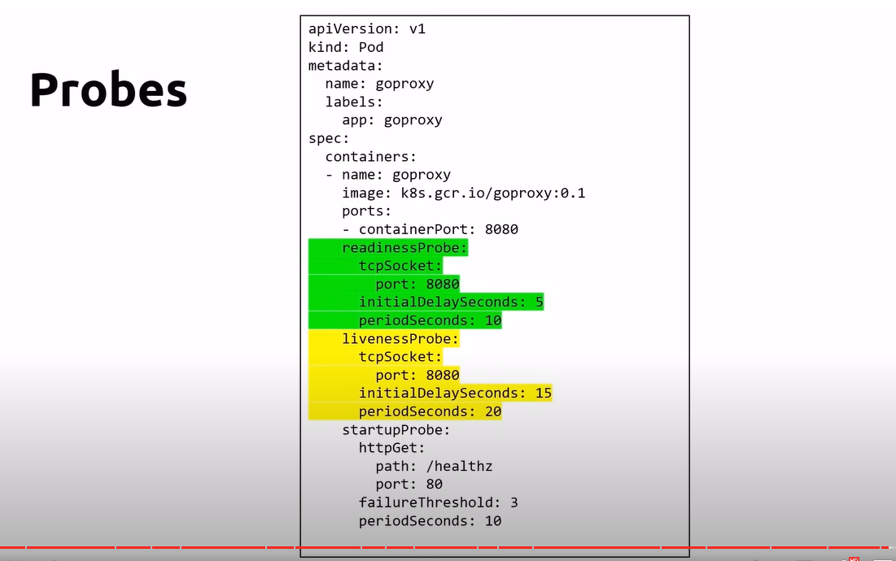
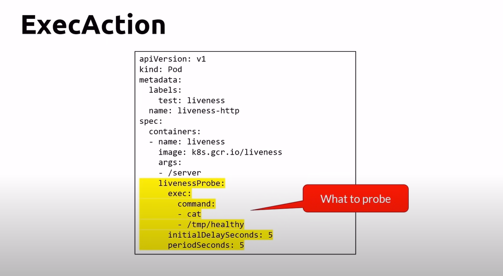
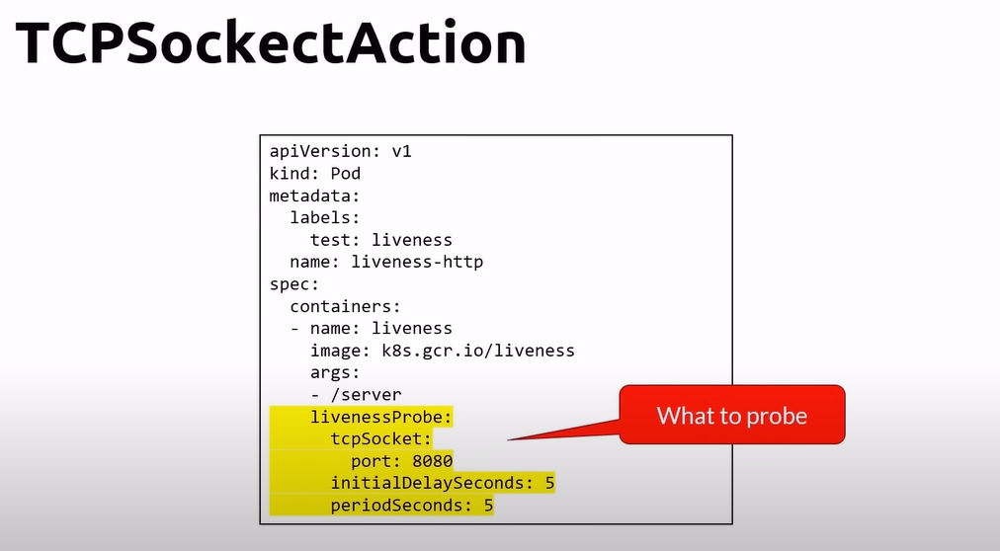
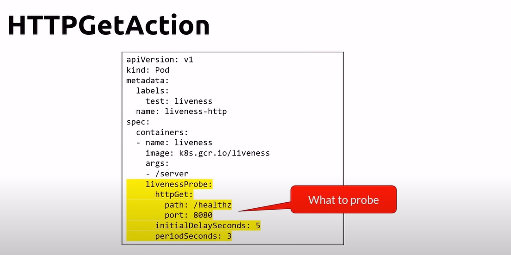

# Observability - Probes

- Startup probes
    - to know when a container has started
- Readiness probes
    - to know when a container is ready to accept traffic
    - a failing readiness probe will stop the application from receiving traffic
- Liveness probes
    - Indicates whether the code is running or not
    - A failing liveness probe will restart the container

    

## Probing the container (liveness probe)
- The kubelet checks periodically the container using probes
- ExecAction
    - execute a command inside the container
- TCPSocketAction
    - Check if a TCP socket port is opnen
- HTTPGetAction
    - Performs an HTTP GET against a specific port and path

