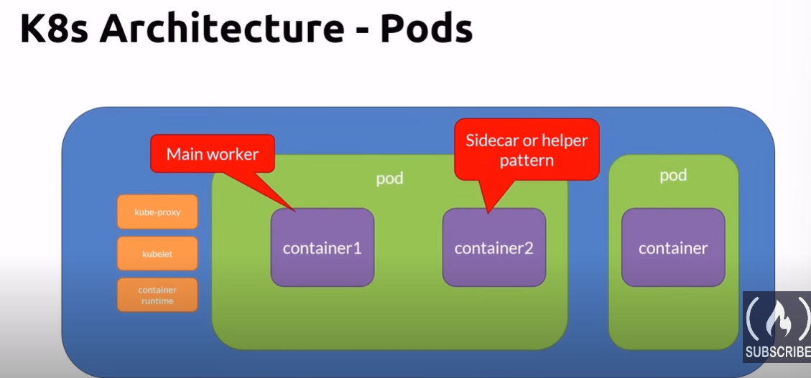
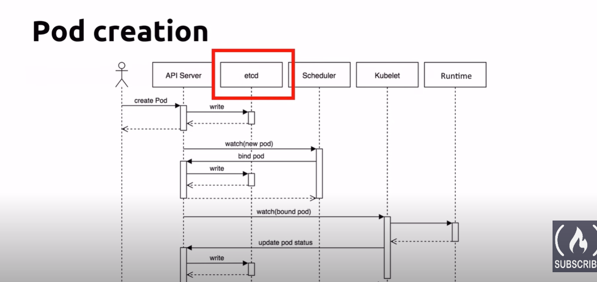
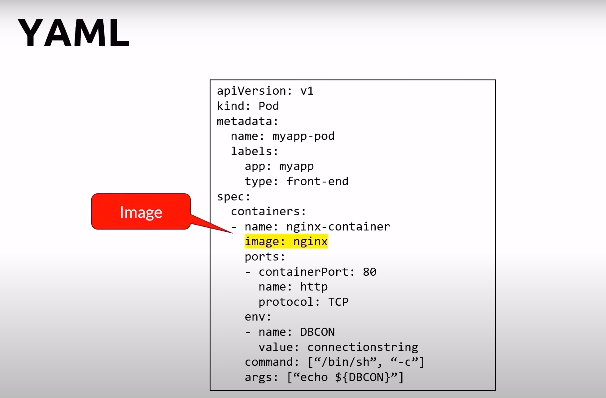
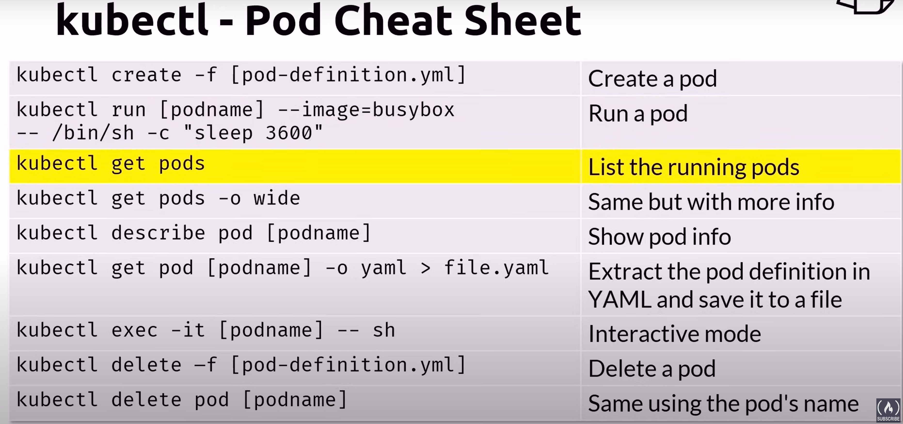
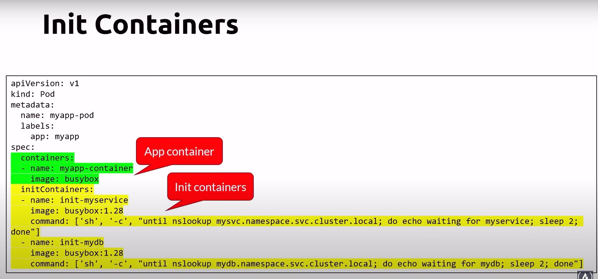

# Pods
- Atomic unit of the smallest unit of work of K8s
- Encapsulates an application's container
- Represents a unit of deployment
- Pods can run one or multiple containers
- Containers within a pod share
    - IP address space, mounted volumes
- Containers within a pod can communicate via
    - localhost, IPC
- Pods are ephemeral
- Deploying a pod is antomic operation, it succeed or not
- If a pod fails, it is replcae with a new one with a shiny new IP address
- You don't update a pod, you replace it with an updated version
- You scale by adding more pods, not more containers in a pod

# Pods lifecycle

## Pod creation

## Pod deletion

## Pod state
- Pending
    - Accepted but not yet created
- Running
    - Bound to a node
- Succeeded
    - Exited with status 0
- Failed
    - All containers exit and at least one exited with non-zero status
- Unknown
    - Communication issues with the pod
- CreashLoopBackOff
    - started crashed started again and then crashed again

# Defining and running pods

## kubectl - Pod Cheat Sheet

# Init Containers
- Initialize a POd before an application container runs
- always run to completion
- each init container must complete successfully before the next one starts
- if it fails, the kubelet repeatedly restarts it until it succeeds
    - unless it's restartPolicy is set to Never
- probes are not supported
    - livenessProbe, readinessProbe, or startupProbe

