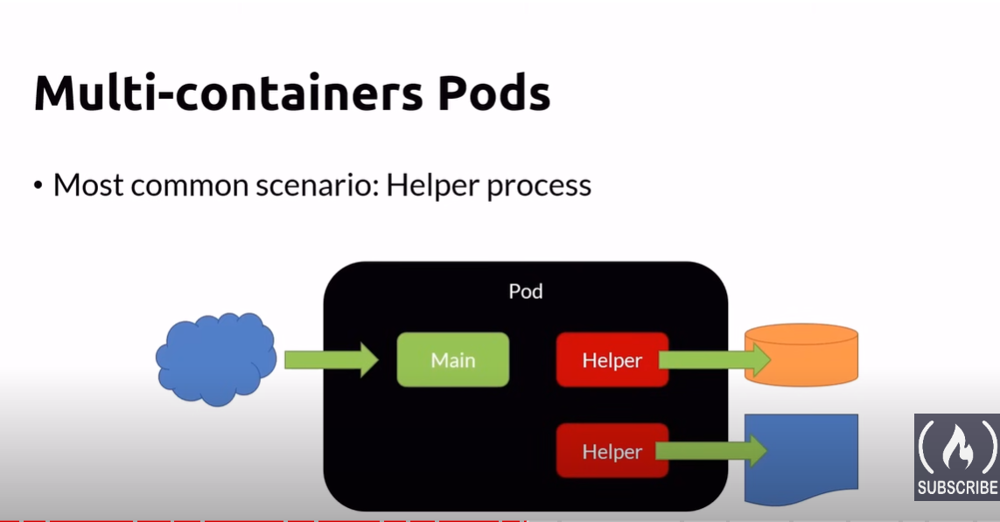
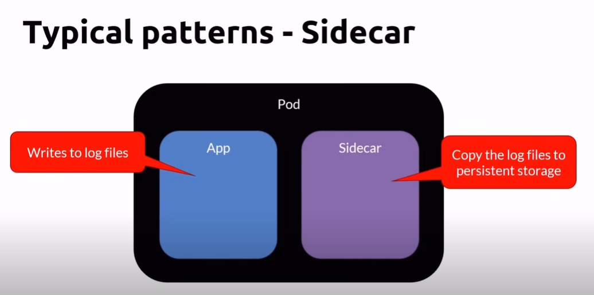
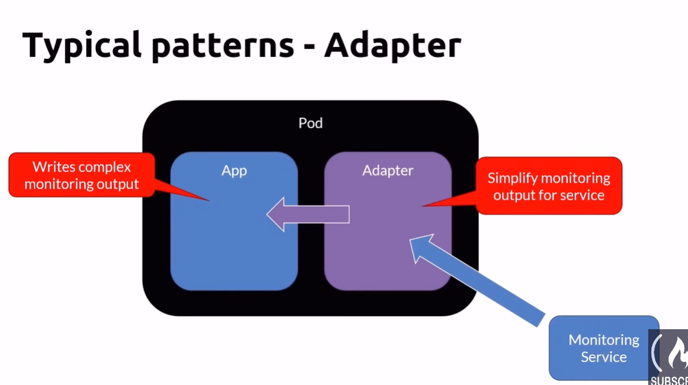
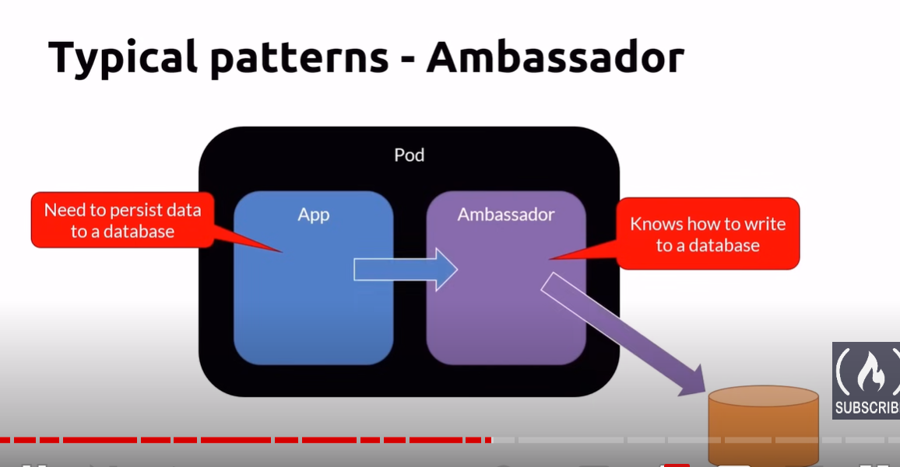
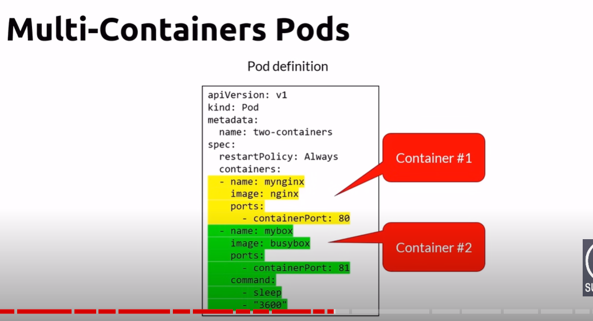
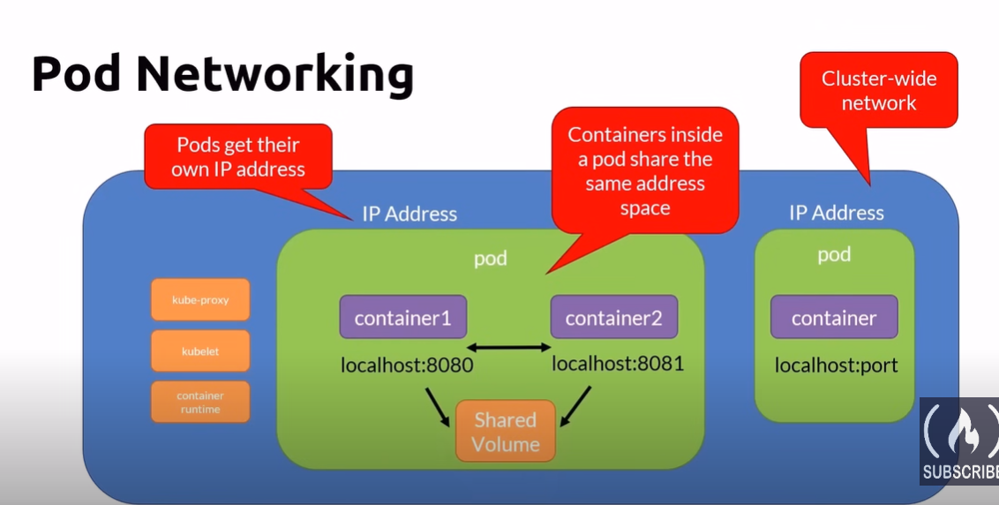
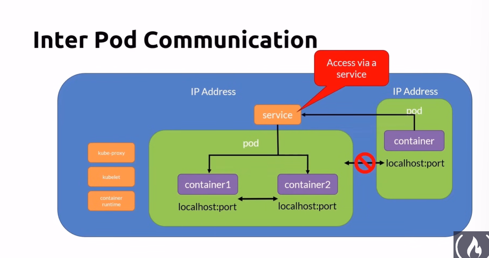

# multi-container pods
- most common scenario: Helper process

## Typical patterns - sidecar

## typical patterns - adapter

## typical patterns - ambassador

## Multi container yaml file

## Cheatsheet

# Networking Concepts
- All containers within a pod can communicate with each other
- All pods can communicate with each other
- All nodes can communicate with all pods
- Pods are given an IP address (ephemeral)
- Services are given a persistent IP

## Pod networking

## inter pod communication

## External access
