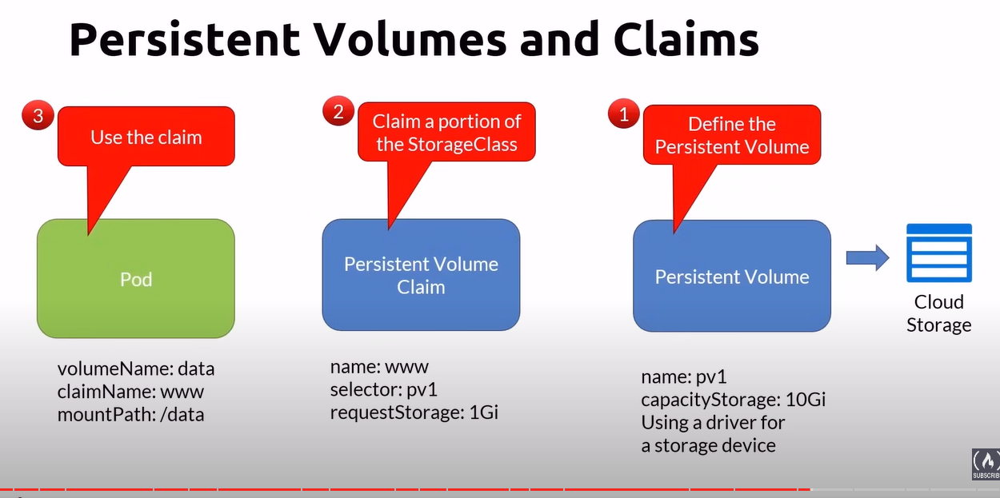
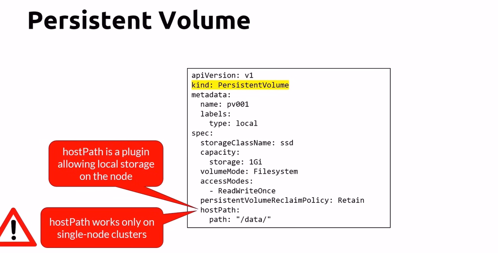
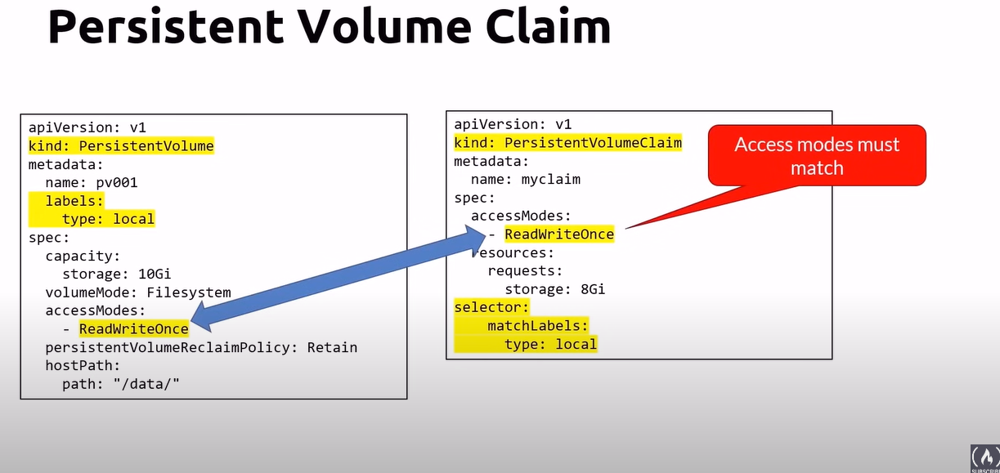
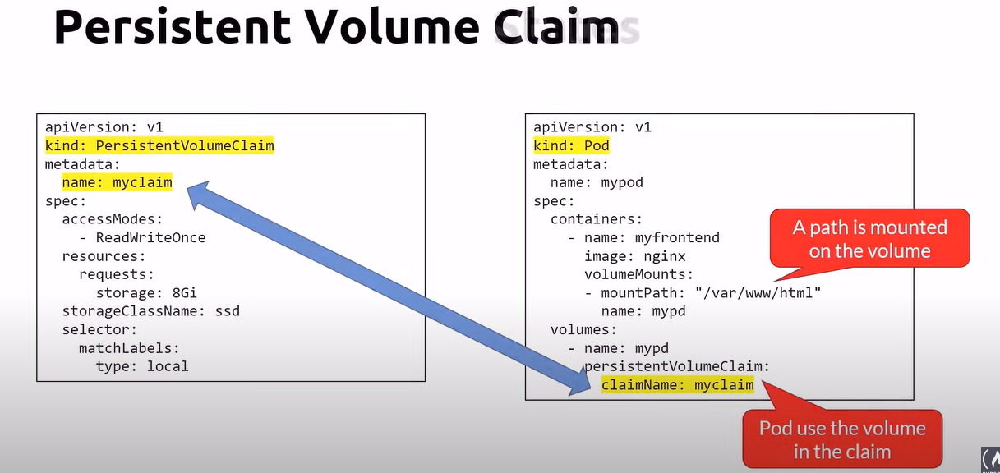
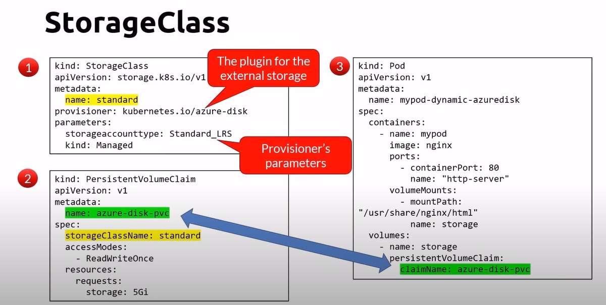
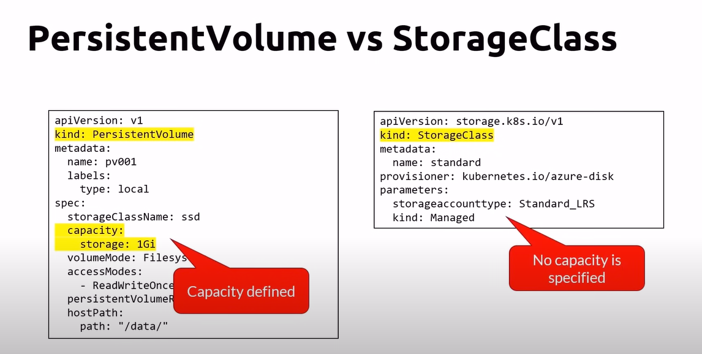
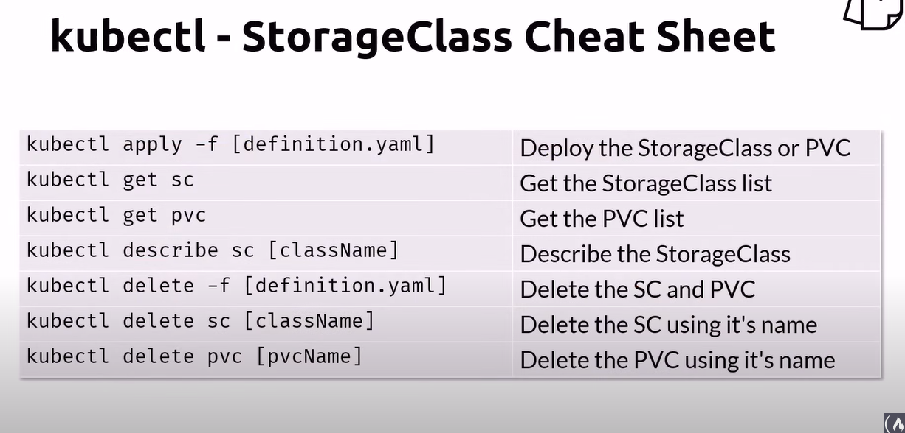

# Storage & persistence

## Volumes
- We need to store data outside the container in a volume
- Volume let containers store data into external storage systems
- Vendors create plugins for their storage systems according to the Container Storage Interface
- Two ways to create storage
    - Static and dynamic

## Persistent Volumes and Claims
- Persisten Volumes
    - represents a storage resource
    - cluster wide
    - Provisioned by an administrator
- Persisten volume claim
    - a one to one mapping to a persistent volume
- one or more pods can use a persistent volume claim

### Reclaim Policies
- Delete
    - Delete the data upon deletion
    - the default
- Retain
    - keeps te data upon pods deletion

### Access Modes
- ReadWriteMany
    - The volume can be mounted as read-write by many pods
- ReadOnlyMany
    - The volume can be mounted read-only by many pods
- ReadWriteOnce
    - The volume can be mounted as read-write by a single pod
    - The other pods are in read-only mode
    - The one that has mounted the volume first will be able to write
    

### Persistent Volume Claim

### persistent Volume States
- Available
    - a free resource that is not yet bound to a claim
- bound
    - the volume is bound to a claim
- released
    - the claim has been deleted, but the resource is not yet reclaimed by the cluster
- failed
    - the volume has failed its automatic reclamation

### cheatsheet - pvc & pv

## Storage & the static way

## Storage & the dynamic way

### StorageClass
- Describes the "classes" of storage offered by the admin
- An abstraction on top of an external storage resource
- No need to set a capacity
- Eliminates the need for the admin to pre-provision a persistent volume

storage class

storage class vs persistent volume

### kubectl storage class cheat sheet

