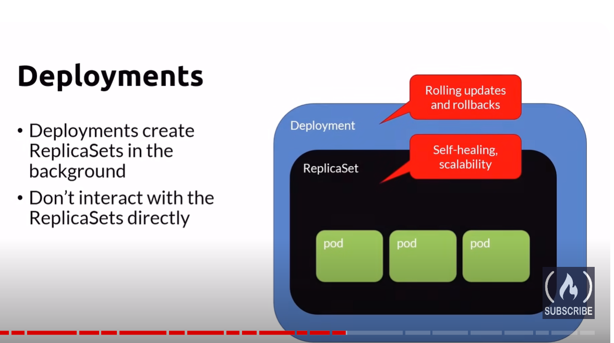
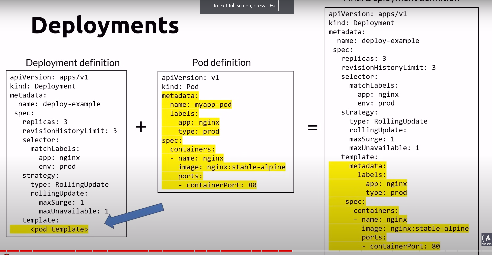
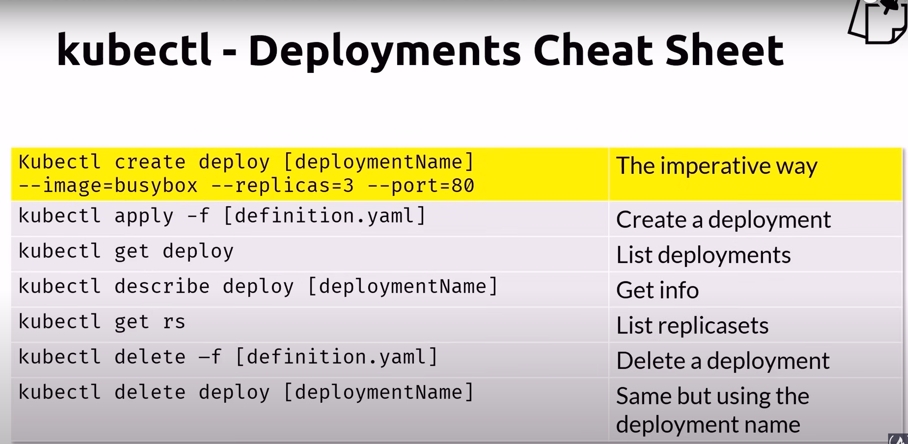

# Deployments
- A deployment manage a single pod template
- You create a deployment for each microservice
    - front-end
    - back-end
    - image-processor
    - creditcard-processor
- create ReplicaSets in the background
- dont interact with replicaSets directly

## Deployments definition in yaml file
- replicas
    - number of pod instances
- revisionHistoryLimit
    - number of previous iterations to keep
- strategy
    - rollingUpdate
        - cycle through updating pods
    - recreate
        - all existing pods are killed before new ones are created

## kubectl cheatsheet
