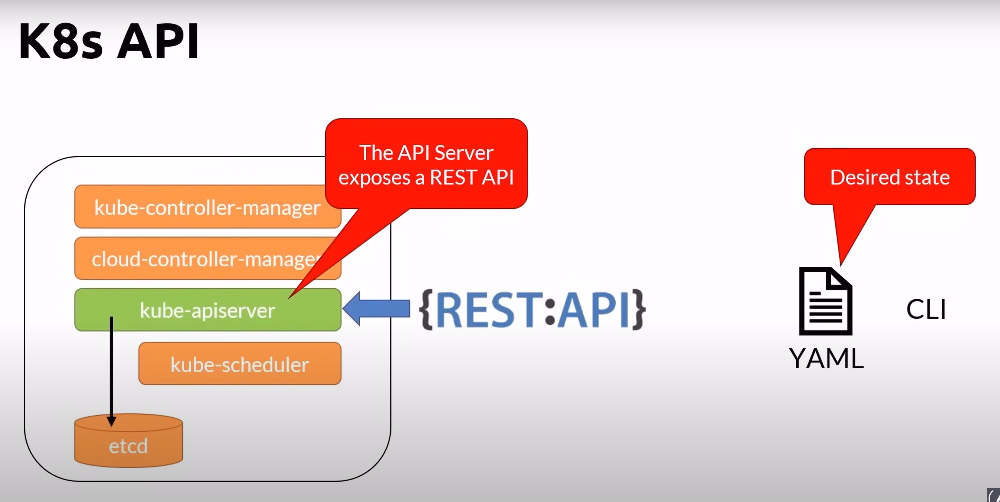
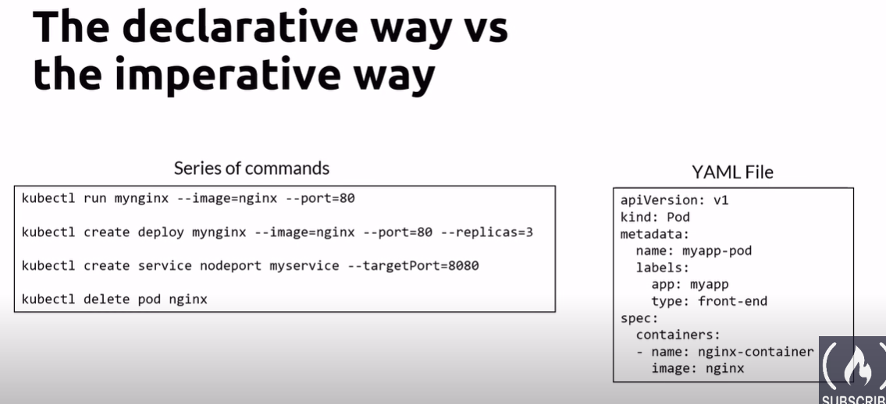
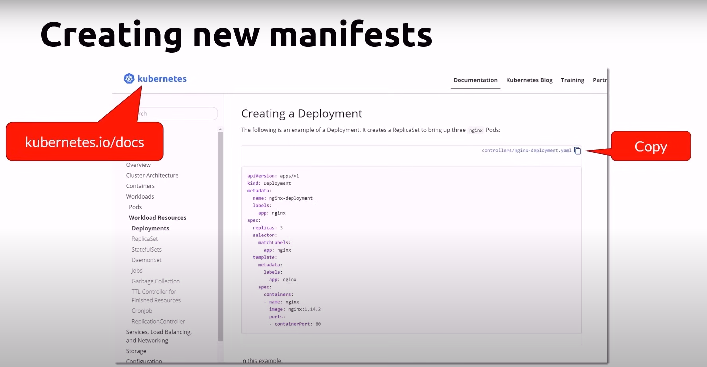
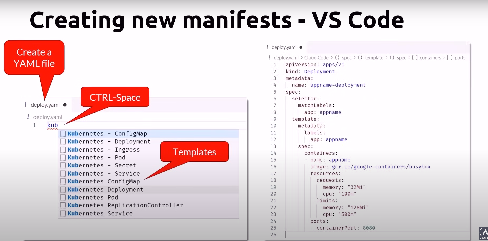

# K8s CLI & Context

## K8s API

## CLI
- kubectl
- Pronounce (pick your choice)
    - kube control
    - kube kuttle
    - kube c-t-l
- Communicates with the apiserver
- Configuration stored locally
    - ${HOME}/.kube/config
    - C:\Users\{USER}\.kube\config

## K8s Context
- A conext is a group of access parameters to a K8s cluster
- Contains a Kubernetes cluster, a user, and a namespace
- The current context is the cluster that is currently the default for kubectl
    - All kubectl commands run against that cluster

## kubectl - Context Cheat Sheet

| kubectl commands      | Description |
|-----------|-----|
| kubectl config current-context     | Get the current context  |
| kubectl config get-contexts       | List all the context  |
| kubectl use-context [contextName]   | Set the current context  |
| kubectl delete-context [contextName]   | Delete a context from the config file  |
| kubectl config rename-context [oldName] [newName]   | rename existing context  |

## Declarative Way & Imperative
1. Imperative
    - Using kubectl commands, issue a series of commands to create resources
    - Great for learning, testing and troubleshooting
    - It's like code
2. Declarative
    - Using kubectl and YAML manifests defining the resources that you need
    - Reproducible, repeatable
    - Can be saved in source control
    - It's like data that can be parsed and modified

## YAML
- Root level required properties
    - apiVersion
        - api version of the object
    - kind
        - type of object
    - metadata.name
        - unique name of the object
    - metadata.namespace
        - scoped environment name (will default to current)
    - spec
        - object specification or desired state

## Creating new manifest - kubernetes.io/docs

## Creating new manifests - VS Code

