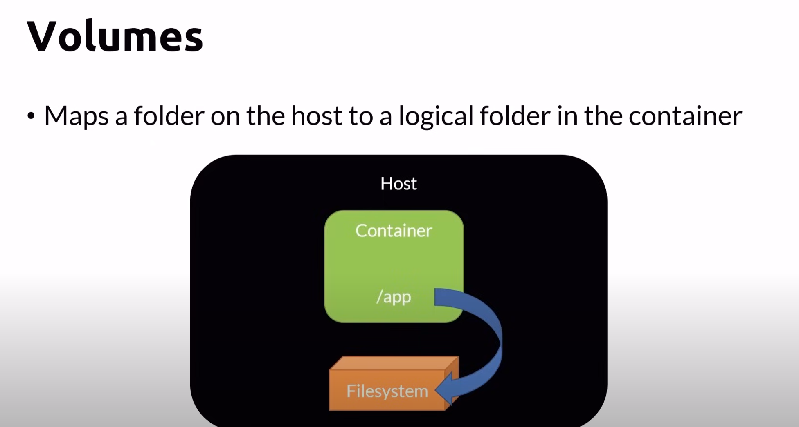

# Persisting data

## Containers are ephemerous (short-lived) and stateless
- You usually don't store data in containers
- Non-persistent data
    - Locally on a writable layer
    - It's the default, just write to the file system
    - When containers are destroyed, so the data inside them
- Persistent data
    - Stored outside the container in a Volume
    - A volume is mapped to a logical folder

## Volumes
- Maps a folderon the host to a logical folder in the container

## Volume Cheat Sheet

| Docker Command | Description |
|-----------------|-----------------|
| docker create volume [volumeName]  | Creates a new Volume    |
| docker volume ls    | Lists the volumes    |
| docker volume inspect [volumeName]    | Display the volume info    |
| docker volume rm [volumeName]    | Deletes a volume   |
| docker volume prune    | Deletes all volumes not mounted   |