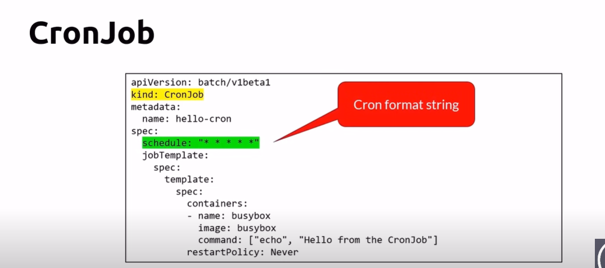
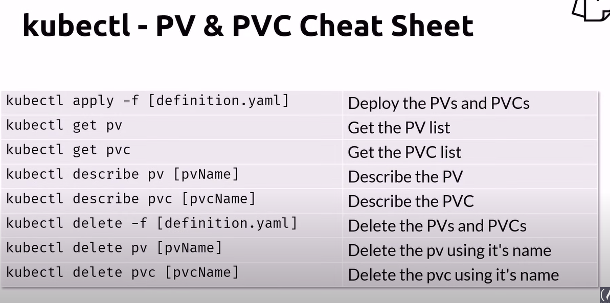

# Cronjob
- An extension of the job
- Provides a method of executing jobs on a cron-like schedule
- UTC only
- History
    - The last 3 successful jobs are kept
    - The last failed job is kept
    - Setting successfulJobsHistoryLimit to zero keeps none

## cheatsheet
