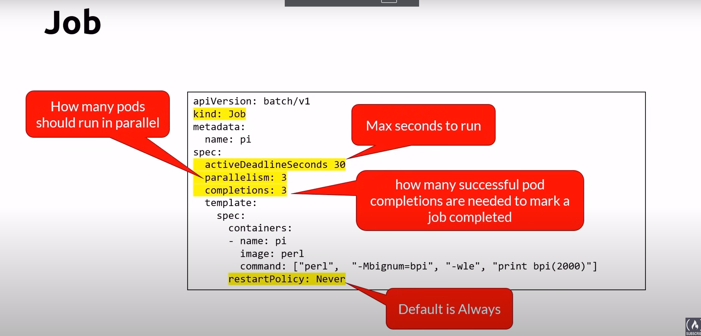

# jobs
- workload for short lived tasks
- creates one or more pods and ensures that a specified number of them successfully terminate
- As pods successfully complete, the job tracks the successful completions
- When a specified number of successful completions is reached, the job completes

## jobs cheatsheet

## Difference between job and cronjob
Differences Between Job and CronJob
Job: Runs immediately when created and runs to completion. It is useful for tasks that need to be run once or on an ad-hoc basis.
CronJob: Schedules Jobs to run at specified times, similar to cron in Unix/Linux. It is useful for recurring tasks, such as daily backups or periodic maintenance.
Use Case Comparison
Job:
One-time data migration.
Processing a batch of data on demand.
Running a script to initialize a service.
CronJob:
Daily database backups.
Weekly cleanup of temporary files.
Monthly report generation.