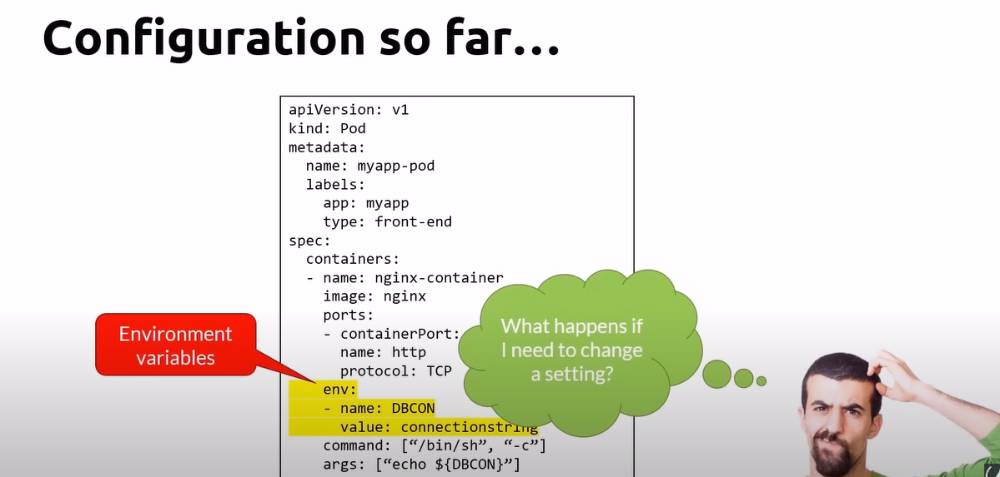
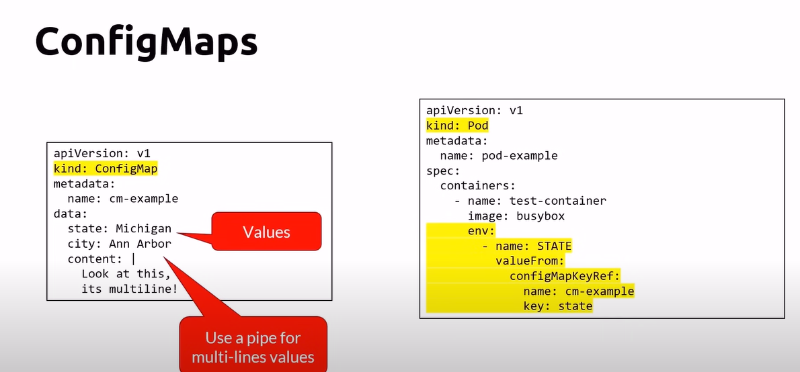
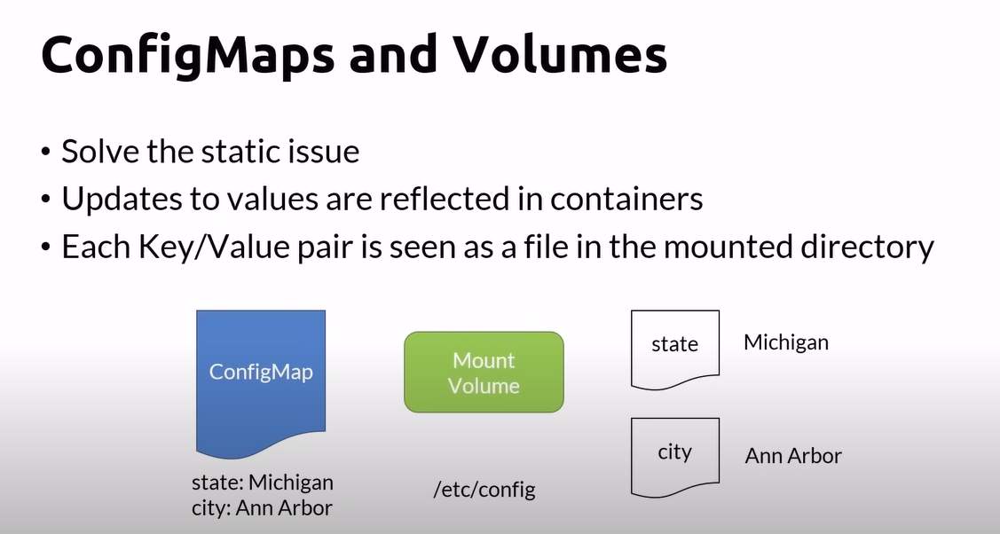
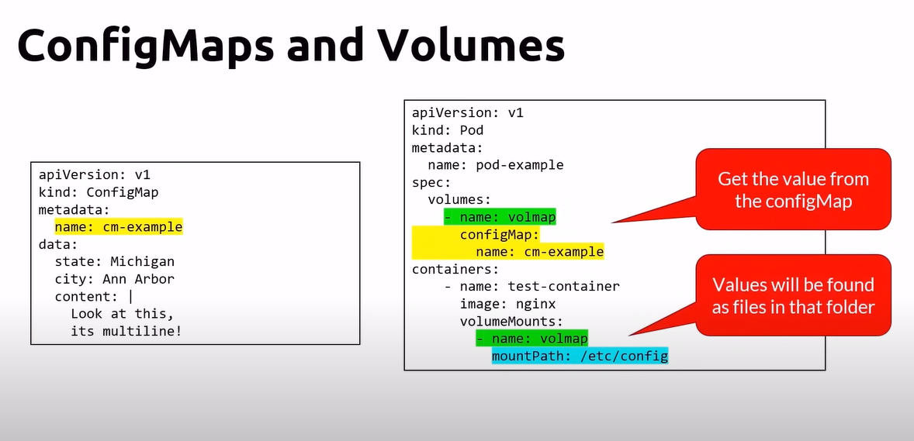

# Configs so far

## ConfigMaps
- Decouple and externalize configuration
- Referenced as environment variables
- Created from
    - Manifests
    - Files
    - Directories (containing one or more file)
- Static meaning that if you change values, the containers will have to be restarted to get them

## ConfigMaps definition

## ConfigMaps and Volumes
- Solve the static issue
- Updates to values are reflected in containers
- Each Key/Value pair is seen as a file in the mounted directory

## configMaps cheatsheet

# Secrets
- Stored as base64 encoded strings
- Not secure as base64 strings are not encrypted
- Should you use secrets?
- protect them using RBAC authorization policies
- or store secrets elsewhere
    - cloud providers offer ways to secure these secrets
        - Azure key vault
        - Aws key management Service
        - Google Cloud KMS
    - HarshiCorp Valut