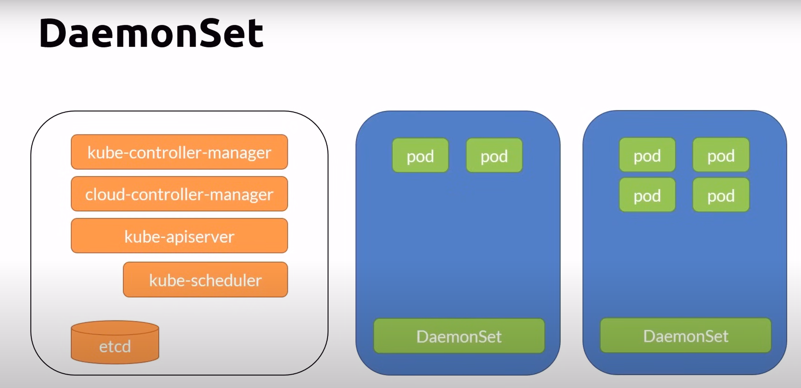
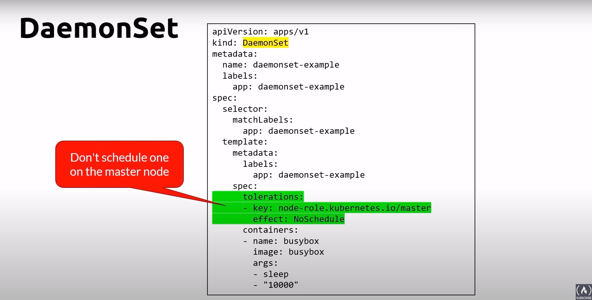
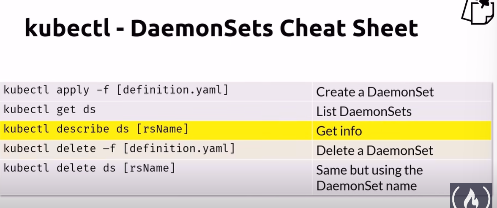

# DaemonSet
- ensures all nodes run an instance of a Pod
- Scheduled by the scheduler controller and run by the daemon controller
- As nodes are added to te cluster, pods are added to them
- Typical uses
    - running a cluster storage daemon
    - rnning a logs collection daemon on every node
    - running a node monitoring daemon on every node

## kubectl cheatsheet

