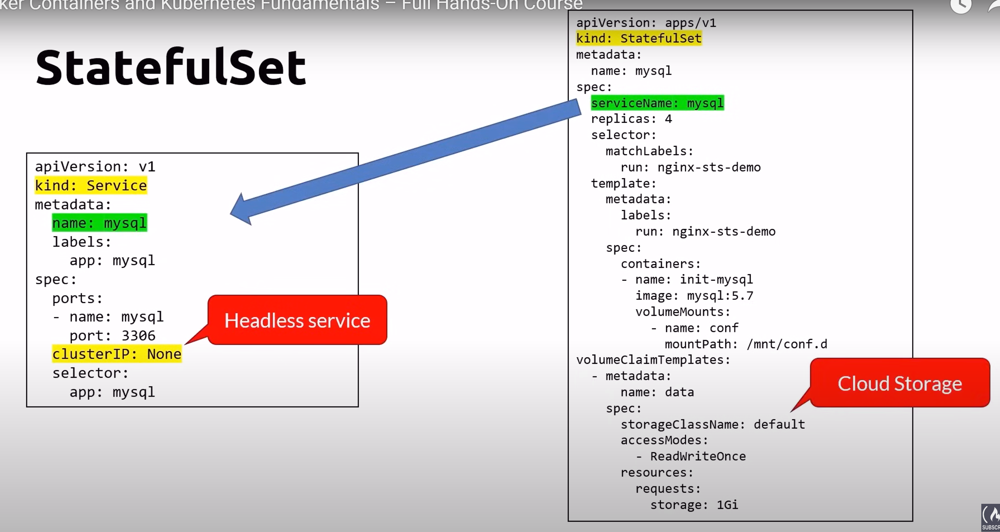

# StatefulSet

## Scaling a database

## StatefulSet
- For pods that must persist or maintain state
- Unlike a Deployment, a StatefulSet maintains a sticky identity for each of their Pods
- Each has a persistent identifier (name-x)
- If a pod dies, it is replaced with another one using the identifier
- Creates a series of pods in sequence from 0 to X and deletes them from X to 0
- Typical Uses
    - stable, unique network identifiers
    - stable databases using persistent storage
- Containers are stateless by design
- StatefulSets offer a solution for stateful scenarios
- A better approach could be to use the Cloud provider database services
- Deleting a statefulSet will not delete the VPXs
    - you have to do it manually

## StatefulSet yaml file

## kubectl cheatsheet

