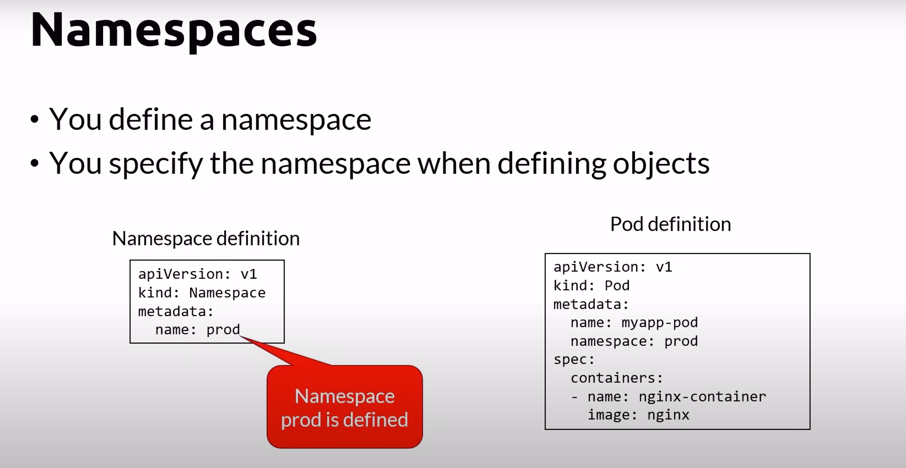

# Namespaces
- Allow to group resources
- K8s creates a default workspace
- Objects in one namespace can access objects in a different one
    - Ex: object.name.**prod**.svc.cluster.local
- Deleting a namespace will delete all its child objects
- You can define a namespace
- You can specify the namespace when defining objects


- You can also define network policy and resource as well


## kubectl - Namespace Cheat Sheet

| kubectl commands      | Description |
|-----------|-----|
| kubectl get namespace     | List all namespaces  |
| kubectl get ns       | shortcut  |
| kubectl config set-context --current --namespace=[namespaceName]   | Set the current context to use a namespace  |
| kubectl create ns [namespaceName]       | Create a namespace  |
| kubectl delete ns [namespaceName]       | Delete a namespace  |
| kubectl get pods --all-namespaces       | List all pods in all namespace  |


## example namespace.yaml file
```
---
apiVersion: v1
kind: Namespace # specify the kind to be Namespace, so that we will know that we are creating or update namespaces
metadata:
  name: development # name of the namespace
---
apiVersion: v1
kind: Namespace
metadata:
  name: production

## if we want to apply this namespace yaml file, we can use kubectl apply -f 02.namespace.yaml

# Purpose of the command:
# 1. kubectl: This is the command-line interface (CLI) tool for interacting with Kubernetes clusters. It allows you to perform various operations such as managing resources, deploying applications, and querying cluster information.
# 2. apply: This is a kubectl command that is used to create or update resources based on the configuration provided in the input file. If the resource does not exist, it will be created. If the resource already exists, it will be updated with the new configuration.
# 3. -f: This flag specifies the filename or URL containing the Kubernetes resource configuration that you want to apply to the cluster.
# 4. 02.namespace.yaml: This is the YAML file containing the configuration for the Kubernetes resource. In this specific case, the filename suggests that it defines a Kubernetes namespace.

## if we want to delete namespaces, we can use kubectl delete -f 02.namespace.yaml
```
