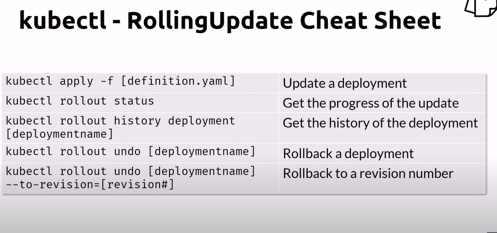
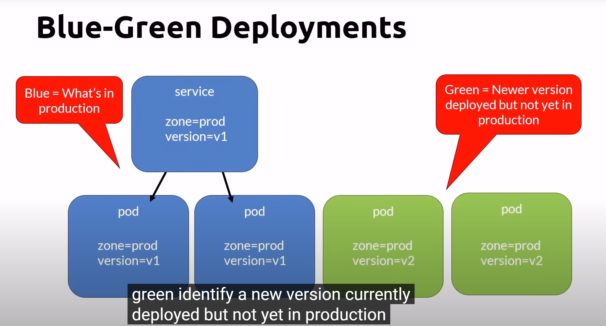

# Rolling Updates

- replicas
    - Number of pod instances
- revisionHistoryLimit
    - Number of previous iterations to keep
- strategy
    - rolingUpdate
        - cycle through updating pods
    - recreate
        - all existing pods are killed before new ones are created
        - there will be a small time that microservices are not functioning

## RollingUpdate key value
- maxSurge
    - maximum number of pods that can be created over the desired number of pods
    - value or percentage
- maxUnavailable
    - maximum number of pods can be unavailable during the update process
- default strategy with maxSurge and maxUnavailable both set to 25%

## kubectl cheatsheet rolling update

## Blue green deployment
- What if we have a database schema changes
- if we use the rolling update strategy, there might be a problem as some of it still using the old schema at some point
- therefore, blue green deployment is there to help in this scenario

- But it still does not solve the new database schema problem entirely
- you need to over provision the cluster size
- you need to have enough resources to have this possible